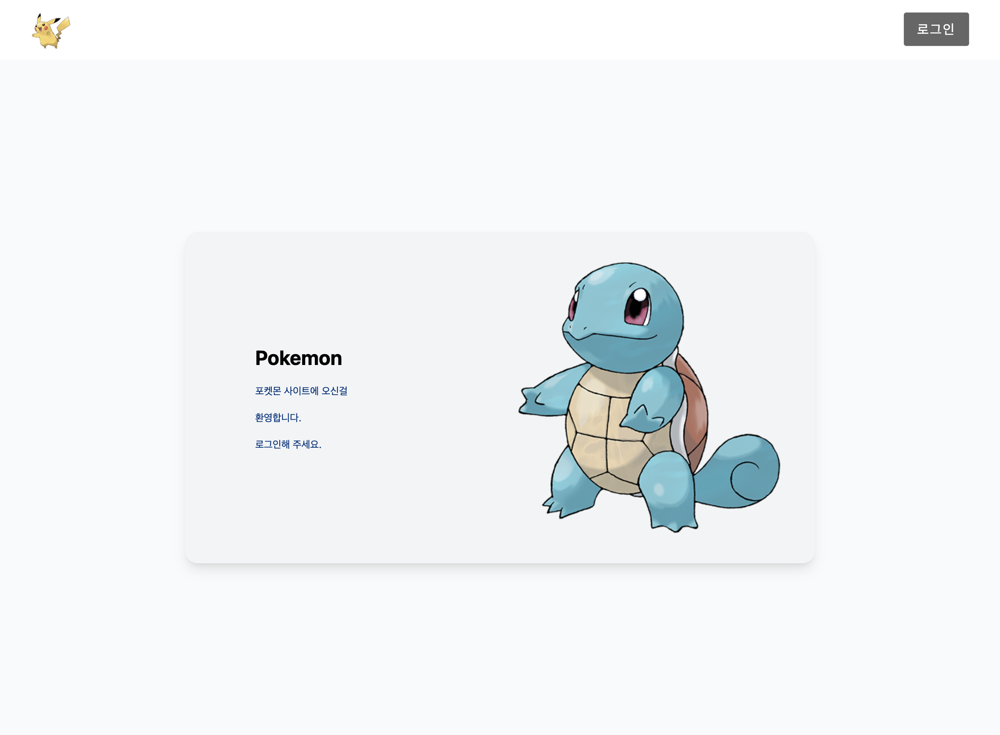
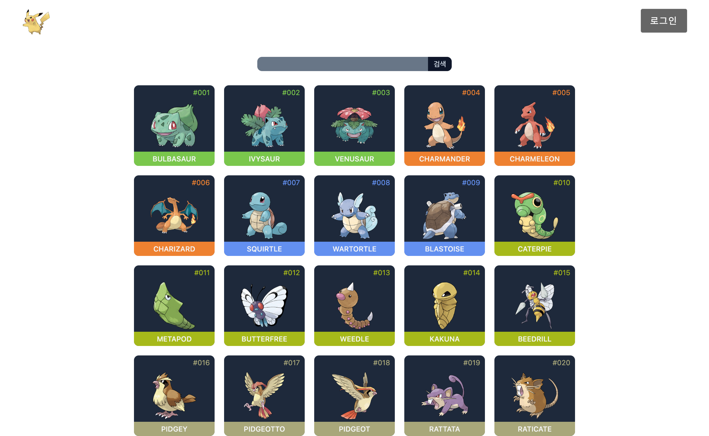
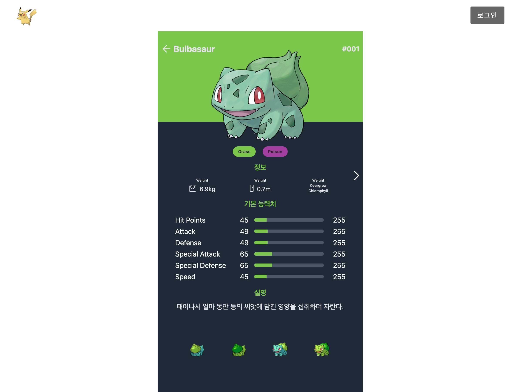

# React Pokemon App

React, Vite, TypeScript를 사용하여 개발된 포켓몬 애플리케이션입니다. PokeAPI를 활용하여 포켓몬 정보를 제공하며, Firebase 연동 및 Tailwind CSS를 이용한 모던한 UI 구성을 특징으로 합니다.

## 🛠 기술 스택 (Tech Stack)

- **Core:** React 19, TypeScript
- **Build Tool:** Vite
- **Styling:** Tailwind CSS, Styled Components
- **Routing:** React Router DOM (v7)
- **Data Fetching:** Axios
- **Backend / Auth:** Firebase

## 📸 스크린샷 (Screenshots)

<p align="center">
  <br>
  <strong>로그인 페이지</strong>
</p>
<p align="center">
  <br>
  <strong>메인 페이지</strong>
</p>

<p align="center">
<br>
<strong>상세 페이지</strong>
</p>

## 🚀 시작하기 (Getting Started)

### 전제 조건 (Prerequisites)

- Node.js (최신 LTS 버전 권장)
- npm 또는 yarn

### 설치 (Installation)

1. 저장소를 클론합니다.

   ```bash
   git clone <repository-url>
   cd react-pokemon-app
   ```

2. 의존성 패키지를 설치합니다.

   ```bash
   npm install
   ```

3. (선택 사항) Firebase 설정이 필요한 경우 `.env` 파일을 생성하여 환경 변수를 설정합니다.

### 실행 (Run)

개발 서버를 실행합니다.

```bash
npm run dev
```

브라우저에서 `http://localhost:5173` (포트는 설정에 따라 다를 수 있음)으로 접속하여 앱을 확인합니다.

## 📜 사용 가능한 스크립트 (Scripts)

- `npm run dev`: 개발 모드로 서버를 실행합니다.
- `npm run build`: 프로덕션 배포를 위해 앱을 빌드합니다.
- `npm run preview`: 빌드된 앱을 로컬에서 미리보기 합니다.
- `npm run lint`: ESLint를 실행하여 코드 스타일과 오류를 점검합니다.
